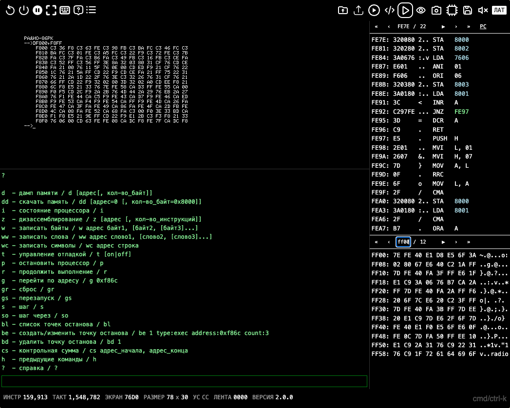

# Эмулятор Радио-86РК

Эмулятор советского домашнего компьютера [Радио-86РК](https://ru.wikipedia.org/wiki/%D0%A0%D0%B0%D0%B4%D0%B8%D0%BE_86%D0%A0%D0%9A) (1986) на базе процессора Intel 8080 (КР580ВМ80А).

Работает в браузере. Построен на SvelteKit и TypeScript. Доступен как веб-компонент `<radio86-emulator>`.

## Возможности

- Полная эмуляция процессора Intel 8080 (проходит все тесты CPU Exerciser)
- Экран 78x30 символов с курсором
- Клавиатура с экранной подсказкой
- Звук через Web Audio API
- Загрузка программ из каталога (180+ программ) или внешних файлов
- Сохранение/восстановление состояния эмулятора (JSON-снимки)
- Скриншоты и дампы памяти
- Ассемблер Intel 8080
- Дизассемблер с навигацией по коду и данным
- Визуализатор набора команд
- Отладочная консоль (дамп памяти, точки останова, пошаговое выполнение)
- Каталог программ со скриншотами

## Запуск

```bash
bun install
bun run dev
```

Откроется на `http://localhost:5173`.

## Сборка

```bash
bun run build
```

Результат в папке `build/` — статический сайт (index.html + ресурсы).

Для деплоя с базовым путём:

```bash
BASE_PATH=/alpha bun run build
```

## Тесты

```bash
just test       # модульные тесты + тесты CPU
just test-ci    # полный набор включая CPU Exerciser
```

## Клавиатура

Горячие клавиши: `Cmd/Ctrl+K`, затем:

| Клавиша | Действие |
|---------|----------|
| L | Выбрать файл |
| O | Открыть каталог |
| G | Запустить программу |
| U | Загрузить внешний файл |
| A | Ассемблер |
| D | Отладчик |
| V | Визуализация |
| B | Помощь по клавиатуре |
| P | Приостановить процессор |
| C | Сигнал RESET |
| R | Перезапустить эмулятор |
| S | Звук |
| F | Полноэкранный режим |
| W | Сохранить состояние |

Раскладка клавиатуры РК86 доступна через экранную подсказку (клавиши кликабельны).

## Отладчик

Режим отладки (`Cmd/Ctrl+K, D`) объединяет дизассемблер и консоль в едином виде.



**Компоновка:**

- Экран эмулятора — слева вверху, в масштабе 1:1 (пиксель в пиксель)
- Дизассемблер — справа от экрана (навигация по коду и данным, кликабельные адреса)
- Консоль — под экраном (команды отладки: дамп памяти, точки останова, пошаговое выполнение)

**Фокус ввода:**

- Клик на экране эмулятора — клавиатура направляется в эмулятор (зелёная рамка вокруг экрана)
- Клик на консоли или дизассемблере — клавиатура переключается на эти панели
- Горячие клавиши (`Cmd/Ctrl+K`) работают в любом режиме

**Команды консоли:**

| Команда | Описание | Пример |
|---------|----------|--------|
| `d` | дамп памяти | `d $F800 $100` |
| `dd` | скачать область памяти в файл | `dd $0 $8000` |
| `z` | дизассемблирование | `z $F800 10` |
| `w` | записать байты | `w $1000 $CD $00 $F8` |
| `ww` | записать слова (16 бит) | `ww $1000 $F800 $F86C` |
| `wc` | записать строку | `wc $1000 hello` |
| `i` | состояние процессора (регистры, флаги) | `i` |
| `p` | остановить процессор | `p` |
| `r` | продолжить выполнение | `r` |
| `g` | перейти по адресу | `g $F800` |
| `gr` | сброс (RESET) | `gr` |
| `gs` | перезапуск | `gs` |
| `s` | шаг (одна инструкция) | `s` |
| `so` | шаг через (step over) | `so` |
| `t` | управление трассировкой | `t on` / `t off` |
| `bl` | список точек останова | `bl` |
| `be` | создать/изменить точку останова | `be 1 type:exec address:$F86C` |
| `bd` | удалить точку останова | `bd 1` |
| `cs` | контрольная сумма | `cs $0 $7FFF` |
| `h` | история команд | `h` |
| `?` | справка | `?` |

**Формат чисел:** поддерживаются форматы `0x1A`, `$1A`, `1Ah`, `1A` (hex определяется автоматически, если содержит a-f).
Стрелки вверх/вниз — навигация по истории команд.

## Автозагрузка через URL

Программу можно загрузить прямо из адресной строки:

| Параметр | Действие |
|----------|----------|
| `?file=<url>` или `?run=<url>` | загрузить и запустить |
| `?load=<url>` | загрузить без запуска |

Значение может быть:

- именем файла из каталога: `index.html?file=CHESS.GAM`
- абсолютным URL: `index.html?file=https://gist.githubusercontent.com/.../raw/sokoban.bin`
- встроенным **data URL** с base64-кодированным содержимым (см. ниже)

### Встроенные data URL

Формат: `data:[<mediatype>][;name=<имя>];base64,<base64>`

Параметр `name=` задаёт имя файла — по расширению определяется формат (`.bin`, `.rk`, `.gam`, `.snapshot.json` и т.д.). Без `name=` используется `inline.bin` (сырой бинарный, загрузка с адреса `0000h`).

Значение параметра URL должно быть percent-encoded (`:` → `%3A`, `;` → `%3B`, `=` → `%3D`, `,` → `%2C`). Поддерживается URL-safe base64 (`-` вместо `+`, `_` вместо `/`).

Пример — байты `21 09 00 CD 18 F8 C3 6C F8 4F 4B 00` как `ok.bin`:

```
index.html?run=data%3A%3Bname%3Dok.bin%3Bbase64%2CIQkAzRj4w2z4T0sA
```

Удобно для генерации ссылок из онлайн-ассемблера или других инструментов — получатель запускает программу без отдельного файла.

## Веб-компонент

Эмулятор доступен как самостоятельный веб-компонент `<radio86-emulator>` размером ~45 КБ.

### Подключение

```html
<script type="module" src="radio86-emulator.js"></script>
```

### Использование

```html
<!-- Минимальный вариант — только монитор -->
<radio86-emulator monitor="mon32.bin" files-path="/files/"></radio86-emulator>

<!-- С автозагрузкой и запуском программы -->
<radio86-emulator monitor="mon32.bin" file="CHESS.GAM" files-path="/files/"></radio86-emulator>
```

### Атрибуты

| Атрибут | По умолчанию | Описание |
|---------|-------------|----------|
| `monitor` | `mon32.bin` | Файл монитора (ПЗУ) |
| `file` | — | Программа для автозагрузки и запуска |
| `files-path` | `files/` | Базовый URL для загрузки файлов |
| `scale` | 1:1 пиксель | `"auto"` для масштабирования браузером |

### Несколько эмуляторов на одной странице

Каждый экземпляр `<radio86-emulator>` полностью независим — собственный процессор, память и экран:

```html
<radio86-emulator monitor="mon32.bin" file="CHESS.GAM" files-path="/files/"></radio86-emulator>
<radio86-emulator monitor="mon32.bin" file="TETRIS2.RK" files-path="/files/"></radio86-emulator>
```

### События

Компонент генерирует событие `ready` после инициализации:

```javascript
document.querySelector("radio86-emulator").addEventListener("ready", (e) => {
    const { machine } = e.detail;
    // machine.reset(), machine.pause(true), etc.
});
```

### Демо

Файл [`demo.html`](https://rk86.ru/beta/demo.html) содержит пример с четырьмя независимыми эмуляторами.


## Терминальный эмулятор

Эмулятор доступен как npm-пакет [`rk86`](https://www.npmjs.com/package/rk86) для запуска в терминале.

```bash
bunx rk86
pnpx rk86
npx rk86
deno run -A npm:rk86
```

С программой:

```bash
bunx rk86 CHESS.GAM
```

### Опции

| Флаг                      | Описание                                            |
|---------------------------|-----------------------------------------------------|
| `-v`                      | Версия                                              |
| `-h`                      | Справка                                             |
| `-l`                      | Список файлов из каталога                           |
| `-m <файл>`               | Монитор (по умолчанию: встроенный mon32.bin)         |
| `-p`                      | Загрузить файл без запуска                          |
| `-g <адрес>`              | Адрес запуска (CPU jump, несовместим с `-p`)         |
| `-G <адрес>`              | Запуск через команду G монитора (инъекция клавиш)   |
| `--exit-halt`             | Выход при выполнении HLT                            |
| `--exit-address [адрес]`  | Выход при переходе на адрес (по умолчанию: 0xFFFE)  |
| `--headless`              | Без отображения экрана (для автотестов)             |
| `--turbo`                 | Выполнение без ограничения скорости (для автотестов) |
| `--timeout <сек>`         | Безопасный таймаут по настенным часам                |
| `--memory <файл>`         | Сохранить память в файл при выходе                  |
| `--memory-from <адрес>`   | Начало области дампа (по умолчанию: `0x0000`)        |
| `--memory-to <адрес>`     | Конец области дампа (по умолчанию: `0xFFFF`)         |
| `--screen <файл>`         | Сохранить экран 78×30 как текст при выходе           |
| `--snapshot <файл>`       | Сохранить снимок состояния (JSON) при выходе         |
| `--input <seq>`           | Инъекция клавиш; `*N` — пауза на N мс                |

### Форматы файлов

- **Бинарный файл** (`.pki`, `.gam`, `.rk`, `.rkr`) — формат магнитофона РК86 с заголовком адресов
- **Сырой бинарный** (`.bin`) — загружается с адреса 0000h (или `10000h - размер` если имя начинается с `mon`)
- **JSON-снимок** (`.json`) — полное восстановление состояния эмулятора

### Примеры

```bash
bunx rk86                                  # запуск монитора
bunx rk86 CHESS.GAM                        # загрузить и запустить файл
bunx rk86 -p CHESS.GAM                     # загрузить без запуска
bunx rk86 --exit-halt prog.bin             # выход при HLT
bunx rk86 --exit-address prog.bin           # выход при JMP FFFEh
bunx rk86 --exit-address 0x1234 prog.bin   # выход при переходе на адрес
bunx rk86 -l                               # список известных файлов

# e2e / воспроизводимые сценарии (детерминированы по тикам CPU)
bunx rk86 --headless --turbo --exit-halt --input "KeyM,Enter,*500,Digit7,Digit6,Enter" --snapshot out.json
bunx rk86 -p prog.bin -G 0x100 --exit-halt    # загрузка + G0100 через монитор
```

Монитор mon32.bin встроен в пакет. Файлы программ загружаются из текущей директории. `Ctrl+C` — выход.

## Структура проекта

```
src/lib/core/       — ядро эмулятора (CPU, память, экран, клавиатура, звук, runner)
src/lib/web/        — браузерный слой (boot, рендерер, звук, магнитофон)
src/lib/terminal/   — терминальный эмулятор
src/lib/component/  — веб-компонент <radio86-emulator>
src/routes/         — SvelteKit страницы и UI-компоненты
static/files/       — бинарные файлы программ (180+)
static/catalog/     — метаданные и скриншоты программ
tools/              — скрипты сборки (каталог, версия)
info/monitor/       — документация монитора, исходники ROM
info/asm/           — примеры программ на ассемблере i8080
tests/              — модульные тесты (164 теста, 1.7M проверок)
tests/cpu/          — таблицы тестов CPU (авто-генерация: bun tests/generate_cpu_data.ts)
```

## Документация монитора

- [MONITOR.md](info/monitor/MONITOR.md) — справочник ПЗУ монитора (карта памяти, точки входа, клавиатура, видео, таблица символов)
- [SNAPSHOT.md](info/SNAPSHOT.md) — формат JSON-снимков эмулятора
- [monitor.asm](info/monitor/monitor.asm) — исходный код монитора (ассемблер i8080)
- [monitor.lst](info/monitor/monitor.lst) — листинг монитора с адресами и дизассемблером

## Лицензия

MIT
